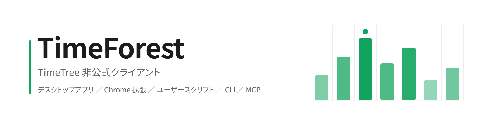
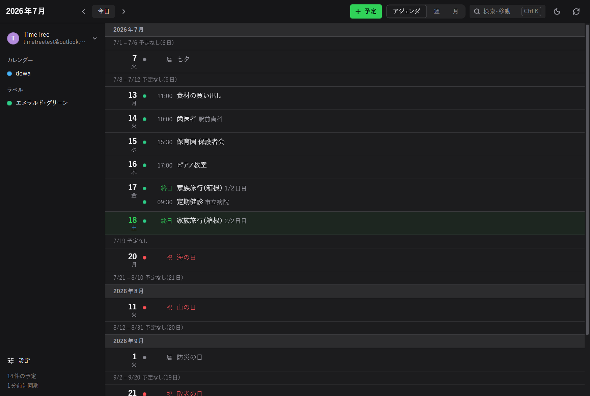
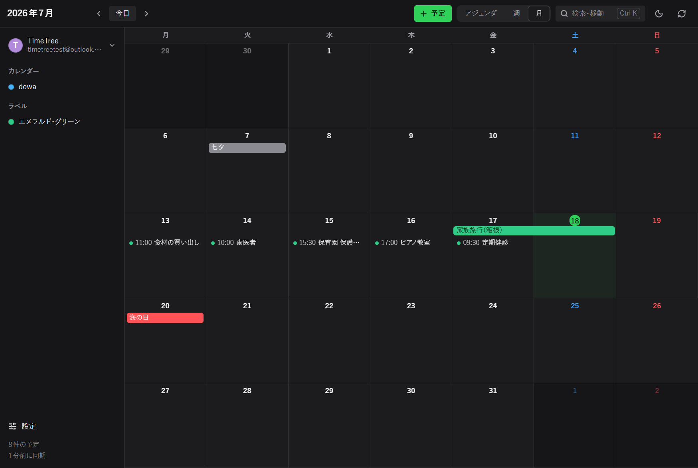
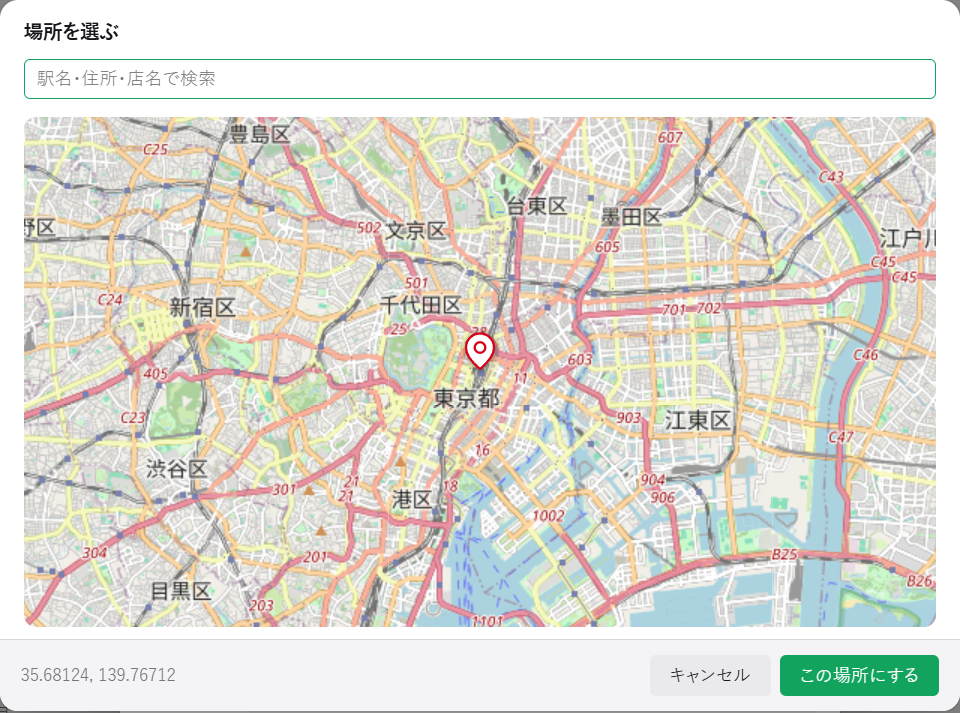
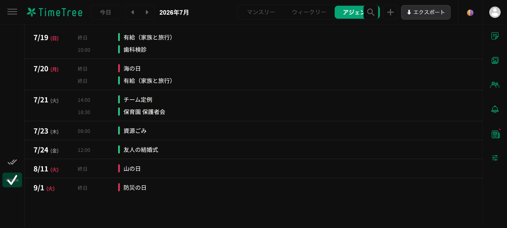
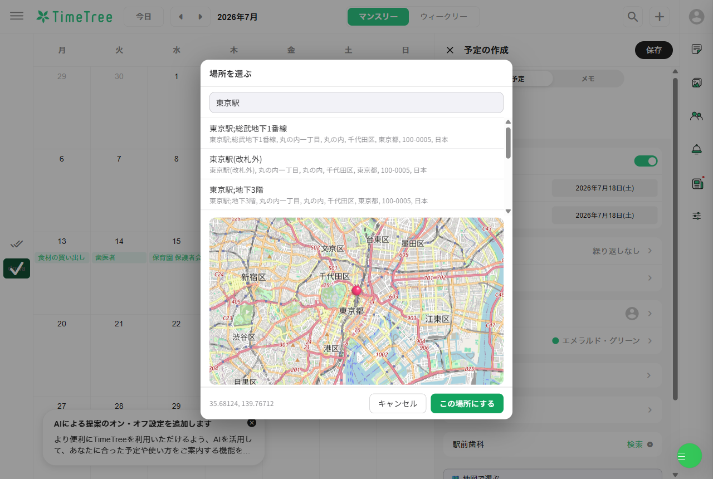
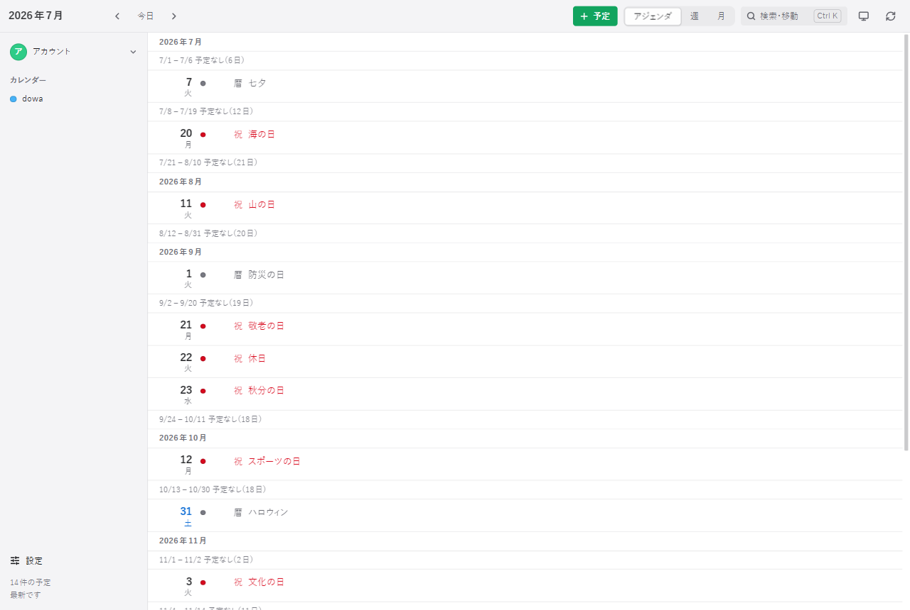

<picture>
  <source media="(prefers-color-scheme: dark)" srcset="docs/banner-dark.png">
  
</picture>

[](https://github.com/nisesimadao/TimeForest/actions/workflows/ci.yml)
&nbsp;
&nbsp;
&nbsp;
&nbsp;
&nbsp;

<!-- SVG, so each renders at its true width. A rasterised PNG shows at its 2x
     intrinsic size in Markdown (too big); these are served straight from the
     repo (relative path, not through camo), so the SVG renders as-is. They're
     generated by tools/badges.js from the repo's own values (Electron major,
     node matrix, dependency count), and scripts/check.js verifies both that each
     value matches its source and that the SVGs reproduce from the generator — so
     a badge cannot drift or be hand-edited without CI going red. A test-count
     badge is deliberately absent — it would lie the moment a test was added. -->

TimeTree 非公式クライアント。**本家（＝公式 TimeTree の Web / アプリ）に無いもの**を、
同じアカウントの同じ予定へ足す道具です — ダークモード、今日から先を縦に読むアジェンダ、
月セルに入り切らない予定の救済、場所の地図ピン、エクスポート（Markdown / CSV / JSON /
ICS）、複数アカウント切替、リマインド通知。

**自分の TimeTree アカウント（無料）が要ります。** 本家にログインして使う道具で、
モックやデモアカウントはありません。

> **免責・商標** — 本ソフトは TimeTree の**非公式**クライアントであり、TimeTree Inc.
> とは提携・出資・承認のいずれの関係もありません。「TimeTree」は権利者の商標で、
> 互換性を示す識別目的でのみ用いています。公式 API ではなく、自分のアカウントの
> 自分のデータを個人的に扱う用途を想定しています。

### まず試すなら

いちばん手軽なのは **Chrome 拡張**（ビルド不要・このリポジトリを `chrome://extensions`
で「パッケージ化されていない拡張機能」として読み込むだけ）→ 下記
[インストール](#インストールpc--chrome-拡張)。ビルド済みの実行ファイル（各 OS の
インストーラ・拡張 zip・ユーザースクリプト）は
[Releases](https://github.com/nisesimadao/TimeForest/releases/latest) からどうぞ。

### 4つの形（`src/lib/*` を共有、コピーは無い）

| | 何 | どこで |
| --- | --- | --- |
| **本リポジトリ直下** | Chrome 拡張 (MV3) | PC のブラウザ |
| **[client/](client/)** | Electron デスクトップクライアント | Windows / macOS / Linux |
| **`dist/*.user.js`** | ユーザースクリプト（本家強化／スマホ用デスクトップ UI の2種） | **スマホ**（iOS Safari / Firefox Android）含む |
| **[web/](web/)** | ブラウザ版（サーバーにデプロイするホスト型） | どのブラウザでも |

（CI がコピーの発生を検出して落とす。ブラウザ版はデスクトップの描画コードもそのまま動かす。）

## 画面

**デスクトップクライアント** — 本家に無いアジェンダ表示。空き日は畳まれ、複数日の
予定は1本の帯になる。



月表示。連続する予定は日ごとのチップではなく1本の帯で（本家 Web は日ごとに切る）。



**場所に地図ピン** — 本家 Web は住所のテキスト欄だけで座標を持てない。OpenStreetMap
で刺したピンの緯度経度を予定に付ける。デスクトップにも、Chrome 拡張にもある。



**Chrome 拡張** — パネルを被せるのではなく、本家 UI に項目を足す。本家の
「マンスリー / ウィークリー」切替に「アジェンダ」が第3のビューとして生え、
月グリッドの代わりに今日から先の一覧を出す（祝日・複数日の予定も、本家純正の
ダークテーマそのままで）。



本家のツールバーそのものにも項目を足す — ⬇ エクスポート、🌗 テーマ切替、
👤 アカウント切り替え、🔔 リマインド通知（絵文字は説明用のラベルで、実際のボタンは
本家に合わせた**モノクロの線アイコン**）。どれも本家のアイコンボタンから複製したので、
右端の 設定 と見分けはつかない。

<picture>
  <source media="(prefers-color-scheme: dark)" srcset="docs/shots/ext-toolbar-dark.png">
  
</picture>

地図ピンは本家の予定フォームに足す。下は本家自身のフォームに「地図で選ぶ」が
生えたところ。見分けはつかない。



**ブラウザ版（ホスト型）** — 拡張もアプリも入れず、URL を開くだけでデスクトップと
同じ UI から TimeTree を操作する。下は素のブラウザで動いているデスクトップ UI。



別オリジンのページは CORS で TimeTree API を読めないので、同一オリジンの薄い
バックエンド（Vercel の関数）がサーバー側で中継する（CORS はブラウザだけの制約）。
認証は自分の `_session_id` を貼る方式で、トークンはこのオリジンの httpOnly クッキーに
入りサーバーには残らない。デスクトップの描画コード（`client/renderer/*`）を無改変で
動かし、地図もサーバー経由で出す。詳細は [web/README.md](web/README.md)。

```sh
npm run check     # 構造チェック + 挙動テスト（依存ゼロ）
npm run build     # → dist/timeforest.user.js（依存ゼロ）
cd client && npm install && cd ..   # ↓のデスクトップ系は先に client の依存を入れる
npm run client    # デスクトップクライアントを起動
npm run dist      # → client/dist/TimeForest-0.1.0-x64.exe（インストーラ）と .zip
```

> **スマホのダークモードが目当てなら** → [スマホで使う](#スマホで使うユーザースクリプト)。
> TimeTree のモバイル**アプリ**にダークモードは無いが、モバイル**Web**にはある
> （隠れているだけ）。アプリを作り直さなくても届く。

## 拡張でできること

すべて **TimeTree 自身の UI に溶け込む形**で足す（かつては全画面ドロワーだったが、
本家のツールバー・ビュー切替・予定フォームに項目を差し込む形にした）:

- **アジェンダ表示** — 本家の「マンスリー / ウィークリー」切替に **「アジェンダ」を
  第3のビュー**として足す。今日から先をひと続きのリストで縦に読める（祝日・複数日の
  予定も、ラベル色そのままで）。月グリッドを行き来しなくていい。予定をクリックすると
  場所・参加者・**作成者アイコン**・メモ・URL を出す詳細カードが開き、**「本家で編集」**
  ボタンが本家そのもののネイティブ編集サイドバーを開く（自前フォームは作らず、本家の
  月表示に切替え → 対象月へ送り → 該当予定を開いて 編集 まで辿る。編集は 100% 本家の UI）。
- **テーマ切替** — TimeTree 自身が持つ純正ダークテーマを、ツールバーのボタンから
  ライト / ダーク / システム連動で切り替える（後述）
- **エクスポート** — ツールバーから Markdown / CSV / JSON / ICS でダウンロード
- **地図ピン** — 本家の予定フォームに、地図から場所（座標）を選ぶ行を足す（本家 Web に無い）
- **アカウント切り替え** — 本家 Web に無い（切替 UI そのものが無い）。ツールバーの
  👤 から、ログイン済みの複数アカウントをパスワード無しで切り替える。別アカウントで
  ログインすると自動で憶える（各アカウントのセッションを差し替えて全タブを読み直す）
- **リマインド通知** — TimeTree はスマホに通知を push するが、この拡張は Chrome
  起動中なら**PC のデスクトップ通知**でも鳴らす（ツールバーの 🔔 で切替、既定オフ）。
  発火判定はデスクトップ版と同じロジック（`model.alertAt`）を Service Worker に載せ、
  `chrome.alarms` で1分ごとに点検する。クリックで TimeTree に戻る

デスクトップクライアントはさらに、週の時間グリッド・月グリッド・コマンドパレット
（`Ctrl+K`）・予定の詳細ポップオーバー・方向を持ったトランジション、そして
**書き込み一式**を持つ:

- 予定の作成・編集・削除
- 繰り返し（作成、および「この回だけ / これ以降 / すべて」の編集・削除）
- 通知（リマインドの設定と、**このアプリ自身がトレイに常駐して鳴らす**こと）
- 参加者・ラベル・チェックリスト・URL・場所・メモ
- **コメント** — 予定ごとのやり取りの読み書き。「誰が何を変えたか」の記録も
  同じ流れに混ざって出る（「日時を変更しました」の下に「じゃあ何時にする？」が
  続く、あの形）。予定が「10:30 歯医者」なら、コメントは**なぜそれが動いたか**。
  家族で1つのカレンダーを使う理由の半分がこれなので、無いと**ただのビューア**になる

無料プランの範囲では本家 Web と機能同等（画像添付だけは有料機能で、無料
アカウントでは本家もできない）。詳細は [client/README.md](client/README.md)。

### 本家 Web に無いもの

**週の始まりを選べる。** 本家 Web は月曜固定で、変える手段が無い（実測:
`/api/v1/user/setting` は `null`、カレンダーオブジェクトにも localStorage にも
それらしいものが無い）。日本の紙のカレンダーと Google カレンダー(ja) は日曜始まり
なので、どちらが正しいかは人による。だから設定にした。既定は本家に合わせて月曜。

ついでに**月グリッドの行数をその月が必要な数にした**（5行か6行）。本家もそうしている
（実測: 2026年7〜12月で 5/6/5/5/6/5）。6行に決め打ちすると翌月をまるまる1週間分
描くだけでなく、同じ高さを分け合うので**1セルが約17%低くなる**。5行の月で実測すると
セルは 100px → 120px になり、同じ日に8件入れたとき**見える数が3件から4件に増えた**
（どちらも溢れは 0px）。隠れる予定が減るということ。

**場所を地図でピン留めできる。** TimeTree は全イベントに `location_lat` /
`location_lon` を持っていて、スマホアプリには場所ピッカーがある。だが**Web 版の
場所欄はただのテキスト入力**で、座標は API に入ったまま読まれない。だから
サードパーティが足せる。スマホで刺したピンもこちらで読める。

地図は**既定でオフ**。オンにするまで、このアプリは TimeTree ただ1つとしか
通信しない。オンにすると、表示する範囲を OpenStreetMap に問い合わせる
（予定の内容は送らない）。タイルも検索もメインプロセス経由で、レンダラには
`data:` URI と素のオブジェクトしか渡らない。だから CSP は `img-src 'self' data:`
のまま締まっているし、「誰と通信するか」は `client/main.js` の1箇所に集まる。
OpenStreetMap のタイル利用ポリシーが要求する User-Agent を名乗れるのも、
`file://` のレンダラにはできないことなので、そこを通す理由になっている。

## 端末から使う（CLI）

`tf` は動作中のデスクトップアプリに問い合わせる（起動していなければ自動で立ち上げる）ので、
初回だけアプリの依存を入れておく: `cd client && npm install`。

```sh
npm link          # tf をパスに置く（戻すなら npm unlink -g timeforest）
```

```sh
tf ls today
tf ls week --cal 仕事
tf ls 7/21 --json
tf find 歯医者               # 日付を知らないとき
tf show 7110a578            # ls が出す先頭8文字でいい
tf say 7110a578 "14時でいい？"
tf add 歯医者 --at "7/21 10:00" --for 1h --where 駅前歯科 --alert 30m
tf add 旅行 --at 8/1 --to 8/3   # 時刻を書かなければ終日
tf edit 7110a578 --at "7/21 10:30"   # ずらす。長さはそのまま
tf rm 7110a578
tf use you@example.com   # → たろう に切り替えました  仕事、プライベート
```

日付は `today 明日 week nextweek month 7/21 2026-07-21 +7d -3d`。
`--from 2026-07-01 --to 2026-07-31` は正しいが、端末に来た理由が
「窓を開くより速いから」なら、それは速くない。

uuid は **ls が出した先頭8文字がそのまま使える**。曖昧なら候補を名指しする
（勝手に1つ選ぶと、共有カレンダーでは違う人に違う通知が飛ぶ）。

**ログインは要らないし、待たされもしない。** 起動しているアプリに訊くだけ。
動いていなければ起動する（トレイに常駐する）。**実測 118ms。**

CLI は素の Node。Electron ではない。理由は3つとも測って決めた:

- **ログインはブラウザのセッション Cookie** で、Chromium の cookie jar
  （DPAPI 暗号化 SQLite）にある。読めるのは Electron だけで、しかも**同時に1つだけ**。
  2つ動かすと失敗の仕方が悪く、CSRF は取れるのにカレンダーが空になる（実測）。
  つまり単体の CLI は「アプリを閉じろ」と言うことになる。**トレイ常駐のアプリに対して、それは逆**
- **アプリは全イベントをメモリに持っている。** 訊けば即座。別プロセスは 4298件を
  取り直すところから始まる（実測 8.1秒 → 118ms、**54倍**）
- **重さは理由ではなかった。** Electron 版の起動は 0.195秒で、遅くない

窓口は**名前付きパイプ**（mac/Linux は userData 下の unix socket）。ポートは開かない。
同じユーザーしか触れないので、認証は OS が既に済ませている。

## アシスタントから使う（MCP）

CLI と同じく動作中のデスクトップアプリに問い合わせる（無ければ自動起動）。先に
`cd client && npm install` でアプリの依存を入れておく。

```sh
claude mcp add timeforest -- node /path/to/TimeForest/client/mcp.js
```

| tool | |
| --- | --- |
| `list_events` | 期間で予定を読む。日付は `today` `week` `7/21` |
| `search_events` | 日付を知らずに探す（「先月の歯医者いつだっけ」）。**探した範囲も返す** |
| `get_event` | 1件の中身（時刻・場所・メモ・繰り返し・通知・参加者） |
| `get_comments` | やり取りと「誰が何を変えたか」 |
| `add_comment` | コメントする |
| `create_event` | 予定を作る。`start` は `"来週火曜 15:00"` のような書き方が通る。**時刻を書かなければ終日**。`reminders: ["30m","1d"]` |
| `update_event` | 直す。書かなかったものは変わらない。ずらすと長さは付いてくる |
| `delete_event` | 消す。繰り返しは `all` を明示しない限り断る |
| `list_calendars` / `list_accounts` / `switch_account` | |

> ⚠ **書き込みは共有カレンダーだと他のメンバーのスマホに通知が飛ぶ。** 下書きではないし、
> 取り消せない。書き込みツールにはその印（`readOnlyHint: false`、`openWorldHint`、
> 削除には `destructiveHint`）が付いていて、Claude Code は許可なしには撃たない
> ── 「確認は一切不要」と命じてもブロックされることを実際に確かめた。

CLI と同じ扉（`client/rpc.js`）に、同じ理由で乗っている。TimeTree の API の知識は
この中に1行も無い。

MCP SDK は使っていない。この repo は依存ゼロで build step も無く、必要なのは
stdio 上の JSON-RPC 4メソッドだけなので、手で書いた（形は仕様書から取った。記憶からではない）。

> ⚠ **stdout はプロトコルのもの。** 途中のどこかで `console.log` を1回撃つだけで、
> クライアントにはツールではなくパースエラーが見える。だから MCP サーバーは何も
> 印字せず、進捗は stderr に出す。`npm run verify:mcp` がそれをガードしている。

## インストール（PC / Chrome 拡張）

ビルド不要。

1. Chrome で `chrome://extensions` を開く
2. 右上の「デベロッパーモード」をオン
3. 「パッケージ化されていない拡張機能を読み込む」→ このフォルダを選択
4. TimeTree（`https://timetreeapp.com/calendars/...`）を開くと、本家のツールバーに
   **エクスポート**と**テーマ**のボタン、**「マンスリー / ウィークリー」切替に
   「アジェンダ」**、予定フォームに**地図ピン**の行が足される

ツールバーのボタン（または `Alt+T`）でアジェンダを開閉、`Alt+D` でテーマ切り替え。

## スマホで使う（ユーザースクリプト）

**TimeTree のモバイルアプリにはダークモードがない。** でもモバイル Web は
レスポンシブで、しかも例の純正ダークテーマをそのまま持っている。つまり
アプリを作り直さなくても、モバイルブラウザ経由でダークモードが手に入る。

スマホには拡張を入れられないので、同じソースから1ファイルのユーザースクリプト
を吐く:

```
node build-userscript.js     # → dist/timeforest.user.js
```

`manifest.json` のファイル一覧をそのまま読むので、拡張版と中身がズレない。
`chrome.storage` は `localStorage` にシムされる。

- **iOS Safari** — [Userscripts](https://apps.apple.com/app/userscripts/id1463298887)（無料）に読み込ませる
- **Android** — Firefox + Tampermonkey、または Kiwi Browser（Chrome 拡張がそのまま動く）

本家の UI に項目を差し込む方式なので、モバイル Web でも本家のツールバーや
月/週の切替が出ていれば、同じアジェンダ・テーマ・エクスポートが足される。
純正ダークテーマは `data-theme` を立てるだけなので確実に効く。

ダークモードだけでよければ、ブックマークレット1行でも足りる:

```js
javascript:document.documentElement.setAttribute('data-theme','dark')
```

### フル版 — デスクトップ UI ごとスマホへ

上のユーザースクリプトが本家のモバイル Web に**項目を足す**のに対し、こちらは
本家のカレンダー画面（`/calendars`）の上に**デスクトップ版の UI をまるごと
載せる**（週の時間グリッド・月グリッド・書き込み・コメントまで、スマホで）。

同一オリジンで動くので、本家に普段どおりログインしていれば——メールでも
Google でも Apple でも——**そのセッションに相乗りするだけ**で、`_session_id` の
貼り付けもログインの受け渡しも要らない。これがホスト版（PC で devtools から
トークンを貼る）に対する、スマホの答え。狭い画面ではサイドバーが ☰ の
ドロワーになり、ツールバーは畳まれる。

ホスト版をデプロイしていれば、同じ場所から入る（ユーザースクリプト
マネージャの自動更新も同じ URL を見る）:

```
https://<あなたのデプロイ>/timeforest-app.user.js
```

ローカルでビルドするなら:

```
node build-app-userscript.js     # → dist/timeforest-app.user.js
```

> **プリビルドの `timeforest-app.user.js`（Releases）は、既定で作者のデモ配信
> `time-forest-five.vercel.app` を自動更新元（`@updateURL`）にしています。** これは
> 作者が動かす公開デモで、インストールすると更新はそこから降り、あなたのセッションの
> トークンはリクエスト毎にそこを**中継**します（サーバーには保存しません。仕組みは
> [web/README.md](web/README.md) / [PRIVACY.md](PRIVACY.md)）。常用するなら
> `TF_WEB_ORIGIN` を自分のデプロイに指して `node build-app-userscript.js` でビルドし、
> 更新元もトークンの通り道も自分の管理下に置くことを勧めます。

`/signin` などログイン前のページには触れない（本家のログインをそのまま使う）。
地図だけは本家ページの CSP に阻まれるので、この版では出ない。

- **iOS Safari** — [Userscripts](https://apps.apple.com/app/userscripts/id1463298887)（無料）
- **Android** — Firefox + Tampermonkey、または Kiwi Browser

## ダークモードについて

**TimeTree は完成したダークテーマを既に出荷している。** `theme-*.css` の中に
`[data-theme=dark]:root` として、専用にデザインされたパレット一式（イベント
ラベル色のダーク版まで: `#2ecc87` → `#06a374`、`#e73b3b` → `#c5031a` …）が入って
いる。ただしアプリがこの属性を一度も設定しないので、常に
`:root, [data-theme=light]:root` が勝って日の目を見ていない。

この拡張がやっているのは `<html data-theme="dark">` を立てるだけ。`light` /
`dark` / `system`（`prefers-color-scheme` 追従）の3つとも TimeTree 側が
ネイティブに対応している。

初版では CSS の `filter: invert()` でページを反転させていたが、捨てた。
カレンダーではラベル色が意味そのものなのに、反転すると海の日が赤→サーモン
ピンク、七夕がピンク→グレーに化けて、色が嘘をつくため。純正テーマなら
デザイナーが1色ずつ決めた値なので全部正しい。

## 仕組み

TimeTree に公開 API はないので、Web アプリが叩いている内部 API に相乗りする。

```
GET /api/v1/calendars                      → カレンダー一覧（alias_code が URL のスラッグ）
GET /api/v1/calendar/{id}/events?since=0   → 全イベント（チャンク方式）
GET /api/v1/calendar/{id}/labels           → ラベル（色は 24bit 整数）
GET /api/v2/calendars/{id}/users           → メンバー
GET /api/v2/memorialdays?country_iso[]=JP  → 祝日・暦（七夕・海の日など）
```

書き込みは単数形になる（読み取りは複数形の `/events`）:

```
POST   /api/v1/calendar/{id}/event         → 作成
PUT    /api/v1/calendar/{id}/event/{uuid}  → 更新（変更分だけ送る。サーバーがマージする）
DELETE /api/v1/calendar/{id}/event/{uuid}  → 削除（ソフト削除。deactivated_at が立つ）
```

必要なヘッダーは2つ。無いと `400 {"error":{"code":-401}}` が返る。

```
x-csrf-token: <meta name="csrf-token"> の値
x-timetreea:  web/2.1.0/ja
```

認証はユーザーの既存セッション Cookie に相乗りするだけ。**認証情報を外部へ送ることは
一切ない**（通信先は TimeTree・OpenStreetMap のみ、認証情報が乗るのは TimeTree 自身への
リクエストだけ）。アジェンダ・エクスポート・地図・テーマは Cookie の値を読むことすら
せず、ブラウザが勝手に付ける Cookie に任せる。

唯一の例外が**アカウント切り替え**で、これだけは各アカウントの `_session_id` を
`chrome.storage.local` に憶え、切り替え時に timetreeapp.com 自身の Cookie に差し替える
（`cookies` 権限が要るのはこのため）。保存先はこの端末のローカルだけ、差し替え先は
TimeTree の Cookie だけで、外部へ出すことはない。要らなければ 👤 メニューの × で消せる。

予定の書き込み（繰り返しの「この回だけ / これ以降 / すべて」）・データモデルの罠・
展開器の検証といった、TimeTree の内部 API を実測で解いた詳細は
[docs/internals.md](docs/internals.md) にまとめてある。

## 構成

```
manifest.json
build-userscript.js  拡張 → 1ファイルのユーザースクリプト（スマホ用・本家に項目を足す）
build-app-userscript.js  デスクトップ UI → スマホ用ユーザースクリプト（本家 /calendars に丸ごとマウント）
src/
  bg.js            ツールバー / ショートカット、OSM タイル、API を worker で中継
  content.js       起動と SPA 遷移への追従、本家 UI への注入をまとめる
  inject-main.js   MAIN world で fetch を監視（本家フォームの予定作成を検知）
  lib/              ← 4つのビルド全部で共有。DOM 非依存の純ロジック
    tz.js          タイムゾーン（終日は UTC、時刻付きは Asia/Tokyo）
    recur.js       RRULE / EXDATE 展開器
    api.js         内部 API クライアント（setTransport で通信層を差し替え可能）
    model.js       生イベント → 日付つき occurrence
    export.js      Markdown / CSV / JSON / ICS
    map.js         OSM スリッピーマップ描画
  ui/dark.js       data-theme の切り替えと維持
  ui/agendaview.js アジェンダを本家の月 / 週トグルに第3ビューとして足す
  ui/darktoggle.js テーマ切替を本家ツールバーに足す
  ui/mapform.js    地図ピンを本家の予定フォームに足す
  ui/exportform.js エクスポートを本家ツールバーに足す
  ui/accounts.js   アカウント切り替えを本家ツールバーに足す（拡張のみ／bg.js が cookie を差し替え）
  ui/notifytoggle.js リマインド通知の切替を本家ツールバーに足す（拡張のみ／bg.js が発火）
client/            Electron デスクトップクライアント（src/lib をそのまま読む）
web/               ブラウザ版（ホスト型）。デスクトップの renderer をそのまま配信
  build.js         自己完結の web/dist を組む（src/lib と client/renderer のコピー、スマホ用ユーザースクリプトも同梱）
  proxy-core.js    /api/tt/* を timetreeapp.com/api/* にサーバー側で中継（CORS 回避）
  map-core.js      OSM タイル / Nominatim をサーバー側で取得（UA 付き）
  host-web.js      window.host のブラウザ実装（renderer を無改変で動かす）
  host-userscript.js  同じ window.host のユーザースクリプト版（同一オリジンの直 fetch）
  app-userscript-boot.js  本家 /calendars を乗っ取りデスクトップ UI を載せる
  dev-server.js    ローカル用（Vercel と同じ経路を依存ゼロで）
api/               Vercel サーバーレス関数（tt プロキシ・connect・map。web/* を共有）
```

`lib/*` は `globalThis` に載せてあるので、拡張・ユーザースクリプト・Service Worker・
Electron のレンダラ・ブラウザ版、どこでも同じものが動く。環境ごとに違うのは通信手段
だけなので、そこは `api.setTransport()` で差し替える（拡張は直 fetch、Electron は
CORS を避けて IPC 経由、ブラウザ版は同一オリジンのプロキシ経由）。

## 開発

```sh
npm run check     # 構造チェック
npm run smoke     # Electron クライアントをヘッドレス起動して健全性を確認
```

`scripts/check.js` は依存ゼロ。ユニットテストではなく、**実際に踏んだバグが
静かに戻ってくるのを防ぐ**ためのもの:

- manifest が存在しないファイルを指していないか
- `src/lib` のコピーが増えていないか（3ビルド共有の破綻）
- `client/main.js` に `net.fetch` が復活していないか（アカウント混線の原因になる）
- ICS の終日 `DTEND` が +1 日されているか（全複数日予定が1日短くなる）
- `model.js` がメモ（category 2）を除外しているか
- 展開器が `COUNT` を尊重するか — これだけはソースの文字列ではなく、
  **実際に展開器を呼んで件数を数えている**。`lib/*` は `globalThis` に載る
  ただの IIFE なので、`require` するだけで本物が動く。依存は増えない

### 実 UI の検証（手動）

構造チェックが通っても「動く」証明にはならないので、**実アプリを実 API に
繋いだまま**外から操作する:

```sh
cd client && npm run inspect   # --remote-debugging-port=9333 付きで起動
npm i playwright-core          # CI は依存ゼロのままにしたいので、ここでだけ入れる
npm run verify:form            # 作成・編集・削除 UI（146 アサーション）
npm run verify:recur           # 繰り返しの6操作（46 アサーション）
npm run verify:notify          # リマインドとトレイ（16 アサーション）
npm run verify:comment         # コメント（51 アサーション）
```

モックは使わない。`14:00 JST` と入力して保存し、**サーバーに `05:00Z` が
入っていることを再同期して読み戻す**のが要点で、モックなら壊れた変換にも
気持ちよく同意してくれてしまう。

同じ理由で `verify:comment` は、コメントを送った後に**取り直して**サーバーに
あることを確かめるし、場所を変えた後に**サーバーが「場所が変わった」と言ってくる**
ことを確かめる。後者は自分のコードを読んでも分からない — 項目コード（`4` = 場所）は
1つずつ実測して埋めた表で、**本家が仕様を変えたら黙って嘘を表示し始める**側だから。

> ⚠ どちらのスクリプトも、**有効なカレンダーが捨てアカウントの `dowa` だけで
> なければ中断する**。共有カレンダーへの書き込みはメンバーへ通知が飛ぶ、
> 取り消しの効かない外向きの操作なので、このガードは飾りではない
> （実際にカレンダー名を `仕事` に書き換えて、中断することを確認済み）。

CI（`.github/workflows/ci.yml`）は Node 20 / 24 でこれを走らせ、ユーザースクリプトの
ビルドが再現可能かを diff で確認し、Electron クライアントを xvfb 上で起動して
プリロードブリッジと共有ライブラリが解決することまで見る。

## パッケージ化

```sh
npm run icons     # client/build/icon.svg → PNG 一式（画像ライブラリ不要）
npm run dist      # → client/dist/ にインストーラ (.exe) と portable (.zip)
npm run dist:dir  # インストーラ無しで client/dist/win-unpacked/ に展開
```

**アプリのルートは `client/` ではなくリポジトリのルート。** 妙に見えるが、
`src/lib` がある理由を思い出せば必然になる: レンダラは `../../src/lib/*.js` を
読んでいて、拡張・ユーザースクリプト・クライアントが**同じファイル**を動かす
（コピーが増えたら CI が落とす）。`client/` だけを包むと共有ライブラリが
入らないし、ビルド時にコピーするのはそのルールが防いでいるドリフトそのもの。
だからルートから包んで、コードが既に使っているパスをそのまま保つ — asar の中でも
`client/renderer/index.html` は `../../src/lib/tz.js` を `src/lib/tz.js` に解決する。

`files` が許可リストなのはこのため（ルートには `scripts/` や 144MB の Electron
もある）。**`scripts/check.js` が、index.html の読むファイルが全部 `files` に
含まれているかを検査する。** ここが漏れると「ソースからは動くのにパッケージ版
だけ白画面」という、出荷してから気づく壊れ方をする。

署名はしていないので、初回起動時に OS が警告を出す（Windows の SmartScreen、
macOS の「開発元を確認できません」）。zip 版も出しているのはそのため（どのみち
警告が出るなら、解凍して実行できる方が筋が良い場面がある）。

**回避は安全側で。** macOS は Finder で対象を**右クリック →「開く」**（システム全体の
Gatekeeper を切る `spctl` 系はやらないこと）。Windows は SmartScreen の「詳細情報」
→「実行」。実行前に、各リリースに添付の `SHA256SUMS.txt` で正しいファイルか確かめられる:

```sh
# macOS / Linux — 添付の SHA256SUMS.txt と照合
shasum -a 256 -c SHA256SUMS.txt
# Windows (PowerShell) — ハッシュを表示して SHA256SUMS.txt と目視照合
(Get-FileHash .\TimeForest-0.1.0-x64.exe -Algorithm SHA256).Hash
```

`SHA256SUMS.txt` はビルドと同じ CI で生成する。ダウンロードの破損・改ざんは検知
できるが、リポジトリ/リリース自体が侵害されれば両方書き換わる点は原理的な限界。

### リリース（GitHub Actions）

`v0.2.0` のようなタグを push すると、[`.github/workflows/release.yml`](.github/workflows/release.yml)
が GitHub Release に成果物を並べる:

- **ユーザースクリプト** — `timeforest.user.js`（拡張ブートストラップ）と
  `timeforest-app.user.js`（スマホ用フル UI）
- **拡張** — `timeforest-extension.zip`（manifest + src + icons。そのまま「パッケージ化
  されていない拡張機能を読み込む」で使える）
- **デスクトップアプリ** — Windows（.exe / .zip）・macOS（.dmg）・Linux（AppImage）を
  各 OS の runner でビルド
- **チェックサム** — `SHA256SUMS.txt`（上記すべての成果物の SHA256）

軽量な成果物（ユーザースクリプト・拡張 zip）は数秒で終わる。Electron は各 OS 分だけ
重いので、リリースを切るときだけ走る（`workflow_dispatch` で成果物だけの試走も可）。

## これから

- **画像添付** — **実装しない（できない）。TimeTree の有料機能だった。**
  本家の添付フローを捕捉すると `POST /api/v1/events/files/presigned_urls`
  `{"original_file_name":"…","media_upload":true}` を投げているが、無料
  アカウントでは本家自身が `400 {"code":-462}` を受け取り
  「プレミアムユーザーのみファイルを追加できます」と表示する。つまりこれは
  実装の差ではなく課金の差で、**無料プランの範囲では本家と機能同等**
- **外部カレンダーへの自動同期** — 見送り。エクスポート（ICS / CSV / JSON / MD）で
  Google などへ取り込めるうえ、ライブ同期は OAuth や常時フィード配信の実装・運用・
  セキュリティのコストが大きい。労力対効果が見合わないと判断した
- **常駐** — 拡張である以上 Chrome が起動している必要がある。Chrome の
  「Google Chrome を閉じた際にバックグラウンド アプリの処理を続行する」を
  有効にすれば、ウィンドウを閉じても動き続ける。完全な常駐が要るなら
  デスクトップクライアントを使う（トレイに常駐する）

## 既知の制限

- **内部 API に依存している。** TimeTree が仕様を変えれば壊れる。公式 API ではないし、
  自動化されたアクセスは TimeTree の利用規約上グレー。自分のアカウントの自分の
  データを個人的に読む用途を想定している
- RRULE 展開は固定オフセットのタイムゾーン（JST / UTC）で正確。DST のある
  タイムゾーンでは遷移をまたぐと1時間ずれ得る
- `x-timetreea` のクライアントバージョンはハードコード（`web/2.1.0/ja`）
- 繰り返しの `INTERVAL` と `COUNT` はフォームから編集できない（保存はされる）。
  「2週ごと」の予定を作りたい場合は本家側で作る
- 画像添付は非対応（上記のとおり有料機能で、無料アカウントでは本家もできない）
- デスクトップクライアントの通知は**アプリが起動している間だけ**鳴る。
  トレイに常駐し、Windows 起動時の自動起動も選べるが、本家アプリのような
  サーバープッシュではない

## ライセンス

コードは [MIT License](LICENSE) — 改変・再配布・商用まで自由（帰属表示と無保証のみ）。

ただし本ソフトは **TimeTree の非公式クライアント**で公式 API ではない。TimeTree
本体の利用規約に従うこと、自分のアカウントの自分のデータを個人的に扱う用途を
想定している点は上記「既知の制限」のとおり。

## 貢献・セキュリティ

- 開発の入り口とルール（共有ライブラリ規約・`npm run check`・4形態の配線）は
  [CONTRIBUTING.md](CONTRIBUTING.md) を参照。
- 脆弱性の報告は公開 issue ではなく [SECURITY.md](SECURITY.md) の手順（GitHub の
  非公開報告）で。セッション/クッキーの扱いに関わるものは最優先で見る。
- 拡張が扱うデータの取り扱い（作者はサーバーを持たず、データは端末内のみ）は
  [PRIVACY.md](PRIVACY.md)。
